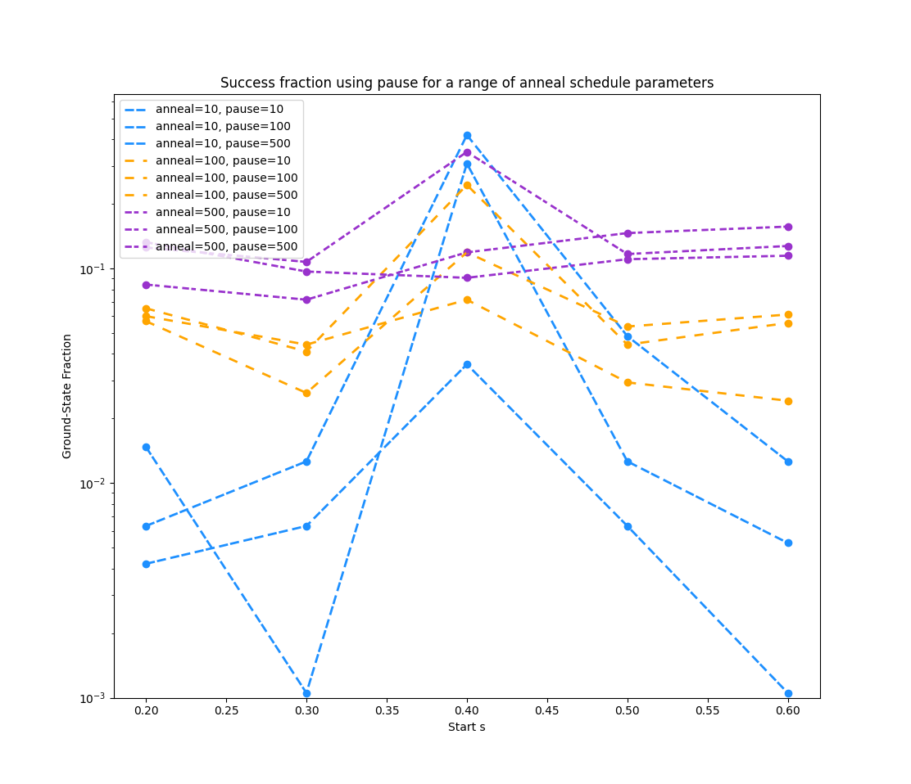

[](
  https://circleci.com/gh/dwave-examples/anneal-schedule-notebook)

# Anneal Schedule

This notebook explains and demonstrates the global anneal scheduling features.
These features can improve solutions to a problem and provide insight into the
behaviour and dynamics of problems undergoing quantum annealing.

*anneal schedule* refers to the global annealing trajectory. It specifies the
normalized anneal fraction, ``s``, an abstract parameter ranging from 0 to 1.
``s(t)`` is a continuous function starting at ``s=0`` for time ``t=0``
and ending with ``s=1`` at ``t=t_f``, the total time of the anneal.

There are two ways to specify the anneal schedule, using two *mutually exclusive*
parameters:

1. ``annealing_time``: Set to a number in microseconds to specify linear growth
   from ``s=0`` to ``s=1`` over that time.
2. ``annealing_schedule``: Specify a list of ``(t, s)`` pairs specifying
   points, which are then linearly interpolated. This feature supports two
   modes&mdash;mid-anneal pause and mid-anneal quench&mdash;which this tutorial
   explores.

The notebook has the following sections:

1. **Understanding the Anneal Schedule** explains the feature.
2. **Using Anneal Schedule Features** shows how to use the feature with an
   interactive example problem.
3. **Mapping Various Anneal Schedules** provides code that sweeps through various
   anneal schedules to explore the effect on results.



## Installation

You can run this example
[in the Leap IDE](https://ide.dwavesys.io/#https://github.com/dwave-examples/anneal-schedule-notebook).

Alternatively, install requirements locally (ideally, in a virtual environment):

    pip install -r requirements.txt

## Usage

To enable notebook extensions[^1]:

```bash
jupyter contrib nbextension install --sys-prefix
jupyter nbextension enable toc2/main
jupyter nbextension enable exercise/main
jupyter nbextension enable exercise2/main
jupyter nbextension enable python-markdown/main

```

To run the notebook:

```bash
jupyter notebook
```

[^1]: Leap's IDE, which runs VS Code, does not support all notebook extensions.

## License

See [LICENSE](LICENSE.md) file.
